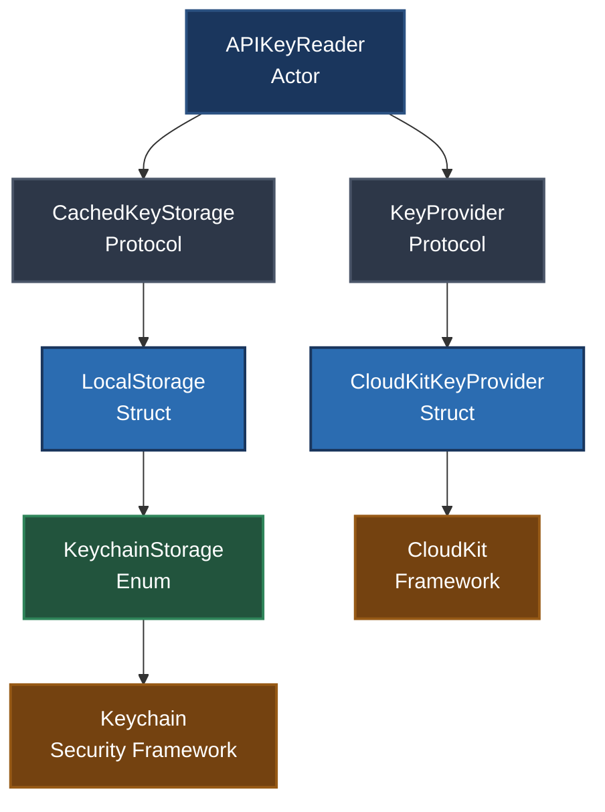
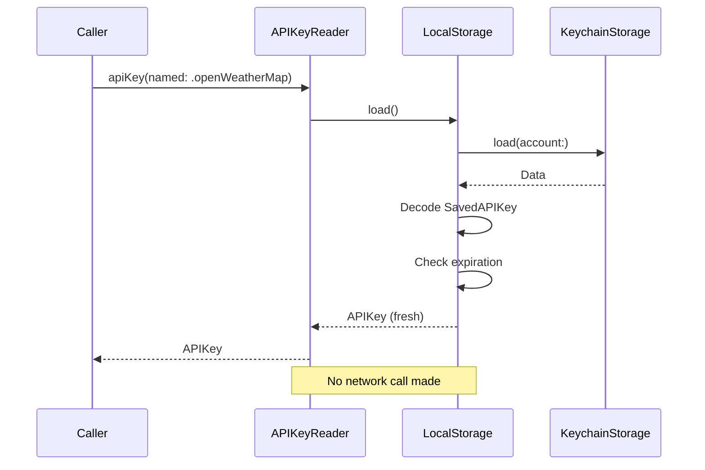
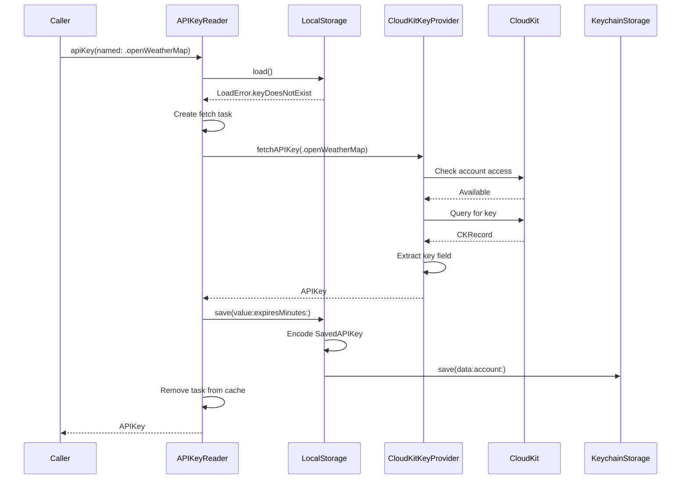
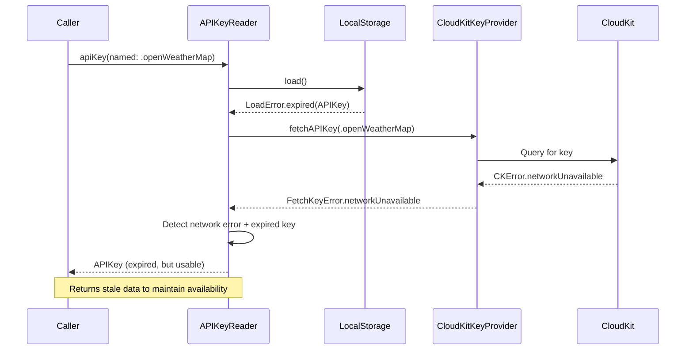
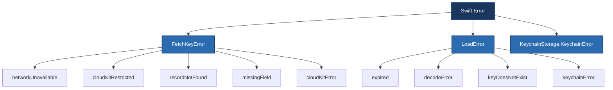

# APIKeyReader Architecture

## Overview

APIKeyReader is a Swift Package that fetches API keys from CloudKit and caches them locally in the Keychain. The architecture prioritizes resilience, type safety, and clear separation of concerns.

## Key Design Decisions

### Why Actor-Based Coordination

`APIKeyReader` is an actor (conforming to `Observable`) because it owns mutable concurrent state that multiple callers may access simultaneously:

- **In-flight task deduplication** (`keyFetchTask` dictionary) — prevents duplicate CloudKit queries when multiple callers request the same key
- **Per-key storage cache** (`storageCache` dictionary) — maintains a single `CachedKeyStorage` instance per key to avoid redundant keychain adapter creation

Without actor isolation, concurrent requests would race on these shared dictionaries, leading to:
- Redundant network calls
- Inconsistent cache state
- Unpredictable fallback behavior when the network is unavailable

The actor serializes all access to these structures, guaranteeing that task deduplication works correctly and that expired key fallback is stable.

**Why Observable conformance?**

`APIKeyReader` conforms to `Observable` to enable SwiftUI and other Observation-aware frameworks to track cache lifecycle events as part of their normal state observation model. This allows views to react to cache updates without manual state management, though the actor's mutable state is intentionally internal (not exposed via `@Published` or similar mechanisms).

### Why Protocol-Based Storage Layer

The storage layer uses protocols (`KeyProvider`, `CachedKeyStorage`) rather than concrete dependencies for three reasons:

1. **Testing flexibility** — Tests can inject mock providers that return predetermined keys or failures without touching CloudKit or the Keychain
2. **Future extensibility** — Different backends (file-based cache, remote key server) can be swapped in without changing `APIKeyReader`'s logic
3. **Separation of concerns** — CloudKit query logic stays in `CloudKitKeyProvider`, keychain operations stay in `LocalStorage`, and `APIKeyReader` owns only coordination

### Why Keychain Over UserDefaults

API keys were moved from UserDefaults to Keychain (`KeychainStorage`) because:

- **Security best practices** — Keychain data is encrypted at rest and excluded from device backups, reducing exposure if a backup is compromised
- **Access control** — `SecAccessControl` with `kSecAttrAccessibleAfterFirstUnlockThisDeviceOnly` ensures keys are available after the first unlock since boot and never sync across devices (appropriate for public CloudKit keys that should be re-fetched per device)
- **Developer expectations** — Developers expect sensitive credentials to be stored in the Keychain, not in plain text in UserDefaults

Note: Biometric access control is intentionally omitted because these keys originate from a public CloudKit database and are not user secrets.

### Why Expired Key Fallback

When a cached key expires and CloudKit is unreachable (network failure, rate limiting), `APIKeyReader` returns the expired key instead of throwing an error. This decision prioritizes **availability over freshness** in degraded network conditions.

**Rationale:**
- API keys typically rotate infrequently (days to weeks)
- Many services accept keys for a grace period after rotation
- Apps can continue functioning offline rather than blocking on network errors

This fallback is explicit in the code path (`expiredKey` parameter passed to `fetchKey`) and logged so developers understand the degraded state.

### Why CloudKit Query Results Are Limited

`CloudKitKeyProvider.queryFirstMatch` uses `resultsLimit: 1` on all queries:

```swift
try await database.records(matching: query, resultsLimit: 1)
```

**Why limit to 1?**
- The `Keys` record type should have unique `name` fields (enforced by schema design)
- Fetching more than one result wastes network bandwidth and CloudKit quota
- The code only uses the first match anyway

This is a performance optimization based on the expected data model.

### Why Single Retry on Rate Limiting

CloudKit rate-limited responses (`CKError.requestRateLimited`) are retried **once** using the server-provided `CKErrorRetryAfterKey` delay:

```swift
let retryAfter = (error as NSError).userInfo[CKErrorRetryAfterKey] as? TimeInterval
try await Task.sleep(for: .seconds(retryAfter))
```

**Why only one retry?**
- Prevents busy-loop behavior under sustained rate limiting
- The retry delay is capped at 30 seconds to avoid blocking the caller indefinitely
- If the retry also fails, the error is classified as `networkUnavailable` and the expired key fallback activates

This balances responsiveness with avoiding CloudKit quota exhaustion.

### Why Centralized Strings.swift

All user-facing and developer-facing error messages are defined in `Strings.swift` using SwiftUI's localization API:

```swift
String(
    localized: "fetch_key_error_network_unavailable",
    defaultValue: "Unable to fetch API key: Please check your internet connection and try again",
    comment: "User-facing error when a network failure blocks API key fetching."
)
```

**Benefits:**
- Single source of truth for error messages
- Localization-ready (string keys can be translated without code changes)
- Comments distinguish user-facing vs developer-facing errors

Developer errors (invalid schema, missing fields) have comments like "Developer-facing error" to guide support teams.

### Why Transient Error Classification

`CloudKitKeyProvider.isTransientError` classifies CloudKit errors into two categories:

- **Transient** (retryable): `networkFailure`, `networkUnavailable`, `serviceUnavailable`, `requestRateLimited`, `serverResponseLost`, `zoneBusy`
- **Permanent** (not retryable): all other errors

**Why this matters:**
- Transient errors map to `FetchKeyError.networkUnavailable`, which triggers expired key fallback
- Permanent errors map to `FetchKeyError.cloudKitError`, which should be reported (e.g., quota exceeded, invalid credentials)

This conservative classification ensures callers can distinguish "try again later" from "this configuration is broken."

### Why Check Account Access First

`CloudKitKeyProvider.checkAccountAccess` verifies iCloud account status before performing a query:

```swift
try await checkAccountAccess()
let query = queryForKey(apiKeyName)
// ...
```

**Rationale:**
- Detects restricted accounts (MDM policies, parental controls) early with a clear error (`cloudKitRestricted`)
- Avoids cryptic query failures when iCloud is disabled
- Provides better error messages to users ("iCloud access is restricted") vs opaque CloudKit errors

This up-front check improves error reporting quality.

### Why Logging Uses .private Privacy

All logs that include `apiKeyName` or account names use `.private` privacy annotation:

```swift
Self.log.debug("Fetching from CloudKit Key: \(apiKeyName, privacy: .private)")
```

**Why:**
- Key names may reveal app internals or business logic that shouldn't appear in crash reports
- iOS redacts `.private` values in system logs unless explicitly enabled
- Follows Apple's privacy best practices for logging

Developer debug builds log the full key name; production logs redact it.

## Architecture Diagram



## Component Responsibilities

| Component | Responsibility | Why This Design |
|-----------|---------------|-----------------|
| `APIKeyReader` | Coordinates fetching, caching, task deduplication | Actor isolation prevents race conditions on shared state |
| `KeyProvider` | Defines remote fetching contract | Protocol enables test mocks and future backend swaps. At package root (`Sources/APIKeyReader/KeyProvider.swift`), adjacent to `APIKeyReader` |
| `CloudKitKeyProvider` | Fetches from CloudKit, handles retries, maps errors | Isolates CloudKit-specific logic from coordinator |
| `CachedKeyStorage` | Defines local caching contract | Protocol decouples keychain operations from coordination. At package root (`Sources/APIKeyReader/CachedKeyStorage.swift`), adjacent to `APIKeyReader` |
| `LocalStorage` | Implements cache using Keychain | Wraps `KeychainStorage` with `SavedAPIKey` encoding/expiry logic |
| `KeychainStorage` | Low-level Keychain operations | Stateless enum with synchronous Security framework calls and task-local test backend injection |
| `SavedAPIKey` | Codable wrapper with expiration metadata | Stores key + timestamp + expiry in single keychain entry |
| `LoadError` | Cache state communication type | Internal to storage layer (`Contains/LocalStorage/LoadError.swift`), distinguishes expiration from missing/corrupt cache |
| `CacheLookupResult` | Cache lookup result | Private to `APIKeyReader`, maps `LoadError` to fetch decisions |
| `Strings` | Centralized localized messages | Single source of truth for error messages, localization-ready |

## Data Flow

### Successful Cache Hit



### Cache Miss with Successful Fetch



### Expired Key with Network Failure (Fallback)



## Error Handling Strategy

### Error Type Hierarchy



### Why Three Error Types

- **`FetchKeyError`** (public) — Exposed to callers, represents fetch failures with localized messages
- **`LoadError`** (internal) — Used by `CachedKeyStorage` to communicate cache state
- **`KeychainStorage.KeychainError`** (internal) — Low-level keychain operation failures

This separation keeps internal storage errors from leaking into the public API.

## See Also

- [CloudKitKeyProvider](CloudKitKeyProvider.md) — CloudKit integration details
- [KeychainStorage](KeychainStorage.md) — Keychain security decisions
- [ErrorHandling](ErrorHandling.md) — Error classification and fallback behavior
