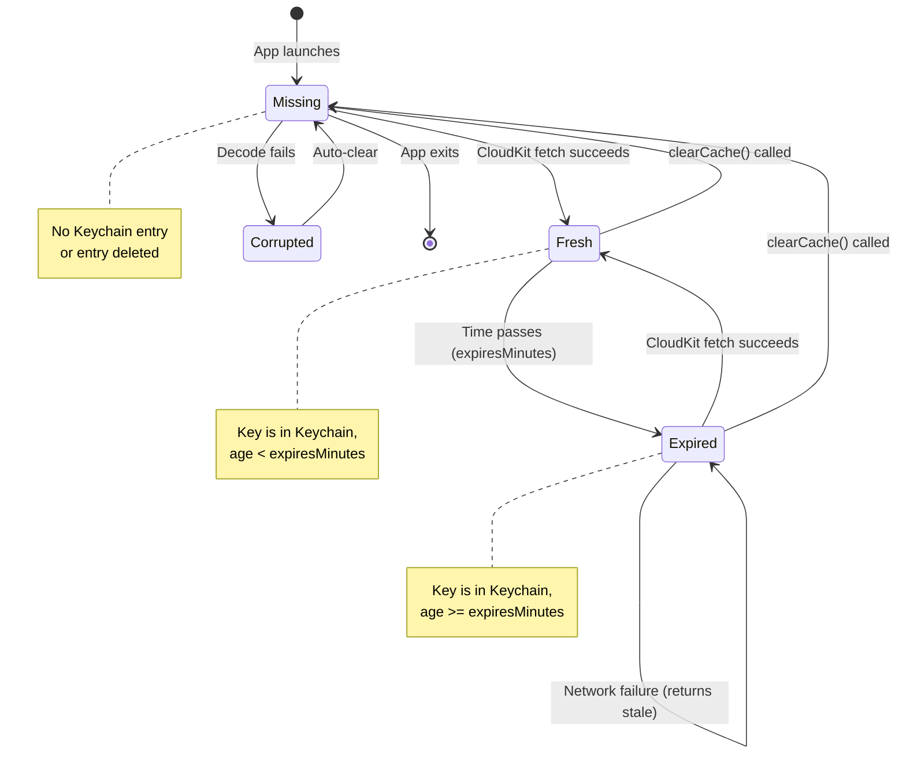
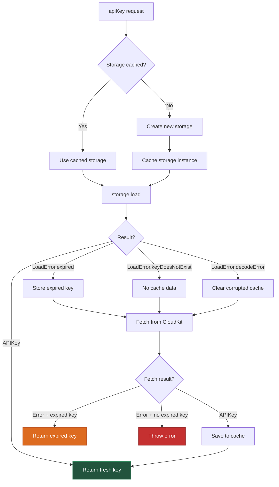

# Caching Strategy

## Overview

APIKeyReader implements a multi-layered caching strategy to minimize CloudKit queries while maintaining data freshness. The cache handles expiration, corruption recovery, and offline fallback.

## Key Design Decisions

### Why Cache at the Actor Layer

`APIKeyReader` maintains two caches:

```swift
private var storageCache: [APIKeyName: any CachedKeyStorage] = [:]
private var keyFetchTask: [APIKeyName: Task<APIKey, Error>] = [:]
```

**Why cache storage adapters?**

- Creating `LocalStorage` instances is cheap, but maintaining one per key avoids redundant factory calls
- The cache ensures that multiple calls for the same key use the same `CachedKeyStorage` instance
- Without this cache, every `apiKey(named:)` call would create a new storage adapter

**Why cache fetch tasks?**

- Deduplicates concurrent requests for the same key
- If two callers request `.openWeatherMap` simultaneously, only one CloudKit query is made
- Both callers await the same `Task`, receiving the result when it completes

Without task deduplication, concurrent requests would spawn multiple CloudKit queries, wasting quota and bandwidth.

### Why Expiration Is Minute-Granular

Expiration is calculated using calendar minutes:

```swift
var expired: Bool {
    let minutes = Calendar.current.dateComponents(
        [.minute],
        from: updated,
        to: Date()
    ).minute ?? 0
    return minutes >= expiresMinutes
}
```

**Why minutes instead of seconds or milliseconds?**

1. **API key rotation cadence** — Keys typically rotate on the order of hours to days, not seconds
2. **Clock skew tolerance** — Minute-level granularity absorbs minor clock drift between devices
3. **Simpler reasoning** — Developers specify cache duration as `expiresMinutes: 60` (1 hour), not `expiresSeconds: 3600`

Finer-grained expiration would add complexity without meaningful benefit for this use case.

### Why Expired Keys Are Returned on Network Failure

When the cache contains an expired key and CloudKit is unreachable, the reader returns the expired key:

```swift
do {
    let freshKey = try await task.value
    await localStorage.save(value: freshKey, expiresMinutes: expiresMinutes)
    return freshKey
} catch {
    if let expiredKey {
        return expiredKey  // Fallback to stale data
    }
    throw error
}
```

**Rationale:**

- **Availability over freshness** — Apps can continue functioning offline with slightly stale keys
- **Graceful degradation** — Many APIs accept keys for a grace period after rotation
- **User experience** — Showing cached data is better than "network unavailable" errors

This fallback is **logged** so developers can detect degraded mode in production.

### Why Decode Errors Clear the Cache

When `SavedAPIKey.decode()` fails, the corrupted entry is deleted:

```swift
catch LoadError.decodeError:
    await localStorage.clear()
    return .missing
```

**Why not retry decoding?**

Decode errors indicate:
- Schema changes (e.g., `SavedAPIKey` fields renamed)
- Keychain data corruption
- Manual tampering with keychain entries

These are **permanent failures** — retrying won't help. Clearing the cache allows:
- Fetching a fresh key from CloudKit
- Saving it with the current schema
- Recovering automatically without user intervention

### Why Cache Keys Are APIKeyName Values

The storage layer uses `APIKeyName.rawValue` as the Keychain account:

```swift
init(key: APIKeyName) {
    self.key = key
}

func load() async throws -> APIKey {
    let data = try KeychainStorage.load(account: key.rawValue)
    // ...
}
```

**Why use the raw string instead of hashing or encoding it?**

1. **Debuggability** — Keychain entries show human-readable account names in Xcode's Keychain viewer
2. **Simplicity** — No need for hash collision handling or reversible encoding
3. **Type safety** — `APIKeyName` is already a validated identifier

Hashing would obscure which keys are cached without adding security (keys are in public CloudKit anyway).

### Why Storage Instances Are Lazily Created

Storage adapters are created on first access:

```swift
private func storage(for apiKeyName: APIKeyName) -> any CachedKeyStorage {
    if let storage = storageCache[apiKeyName] {
        return storage
    }

    let storage = localStorageFactory(apiKeyName)
    storageCache[apiKeyName] = storage
    return storage
}
```

**Why not create all storage instances at initialization?**

- Apps may define dozens of `APIKeyName` extensions but only use a few at runtime
- Lazy creation avoids allocating storage for unused keys
- The cache ensures each key gets exactly one storage instance (no duplicates)

### Why clearCache Removes from storageCache

Clearing a key's cache also removes its storage adapter:

```swift
public func clearCache(for apiKeyName: APIKeyName) async {
    if let storage = storageCache.removeValue(forKey: apiKeyName) {
        await storage.clear()
    } else {
        await localStorageFactory(apiKeyName).clear()
    }
}
```

**Why remove the adapter?**

`removeValue(forKey:)` atomically removes and returns the cached adapter. If present, its keychain entry is cleared. If no adapter was cached (e.g., clear called before any fetch), a temporary storage instance clears the keychain entry directly.

After clearing, the next `apiKey(named:)` call will:
- Create a fresh storage instance
- Fetch from CloudKit (no cached data)

## Cache Lifecycle



## Cache Lookup Flow



## Cache Performance Characteristics

| Operation | Time Complexity | Notes |
|-----------|----------------|-------|
| First fetch (cold cache) | O(n) network + O(1) keychain write | n = CloudKit query latency |
| Subsequent fetch (warm cache) | O(1) keychain read | <5ms on modern devices |
| Concurrent deduplication | O(1) task lookup | Both callers await same Task |
| Cache clear | O(1) keychain delete | Synchronous Security framework call |

## Cache Size Estimates

Assuming typical API keys are 32-64 characters:

| Component | Size | Notes |
|-----------|------|-------|
| `APIKey.rawValue` | 32-64 bytes | String data |
| `SavedAPIKey.updated` | 8 bytes | Date (Unix timestamp) |
| `SavedAPIKey.expiresMinutes` | 4 bytes | Int |
| JSON overhead | ~20 bytes | Codable encoding metadata |
| **Total per key** | ~64-96 bytes | |
| **10 keys** | ~640-960 bytes | Negligible memory footprint |

The storage cache (`storageCache` dictionary) holds lightweight adapter structs, adding minimal overhead.

## See Also

- [Architecture](Architecture.md) — Actor-based cache coordination
- [KeychainStorage](KeychainStorage.md) — Low-level cache persistence
- [ErrorHandling](ErrorHandling.md) — LoadError types and fallback logic
