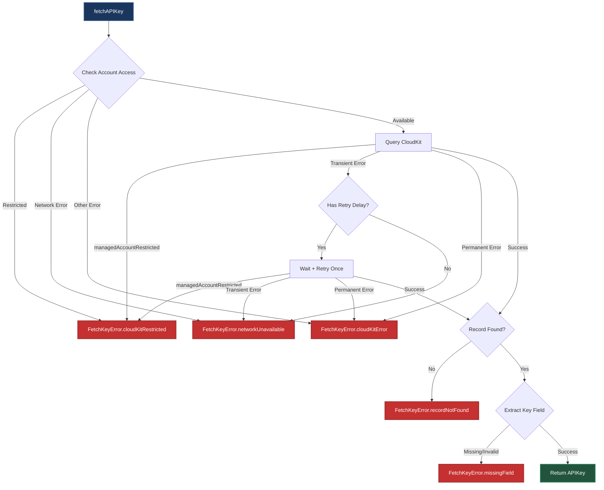

# CloudKitKeyProvider

## Overview

`CloudKitKeyProvider` handles all CloudKit interactions for fetching API keys. It queries the public database, maps CloudKit errors to domain errors, and implements retry logic for transient failures.

## Key Design Decisions

### Why Query Limits of 1

Every CloudKit query uses `resultsLimit: 1`:

```swift
try await database.records(matching: query, resultsLimit: 1)
```

**Rationale:**
- The `Keys` record type uses unique `name` values (enforced by schema design)
- Only the first matching record is used
- Limiting results reduces:
  - Network bandwidth consumption
  - CloudKit quota usage
  - Server processing time

This is a performance optimization based on the expected 1:1 relationship between key names and records.

### Why Pre-Query Account Access Check

The provider calls `checkAccountAccess()` before performing a query:

```swift
try await checkAccountAccess()
let query = queryForKey(apiKeyName)
```

**Why not rely on query errors?**

CloudKit queries return cryptic errors when iCloud is disabled or restricted. Pre-checking the account status provides:

1. **Better error messages** — "iCloud access is restricted" vs generic CloudKit errors
2. **Early detection** — Fails fast without consuming CloudKit quota
3. **User guidance** — Restricted accounts indicate MDM policies or parental controls that users can address

The check verifies both API-level access and account status:

```swift
let status = try await container.accountStatus()
if status == .restricted {
    throw FetchKeyError.cloudKitRestricted
}
```

### Why Single Retry with Bounded Delay

Rate-limited responses (`CKError.requestRateLimited`) are retried once using the server-provided delay:

```swift
guard let retryAfter = boundedRetryInterval(from: error) else {
    throw FetchKeyError.networkUnavailable
}
try await Task.sleep(for: .seconds(retryAfter))
return try await queryFirstMatch(for: query)
```

**Design choices:**
- **Single retry** — Avoids busy-loop behavior under sustained rate limiting
- **Server-provided delay** — Respects CloudKit's backoff guidance via `CKErrorRetryAfterKey`
- **30-second cap** — Prevents indefinite blocking if the server returns an unreasonable delay

If the retry fails with another transient error, it's mapped to `networkUnavailable` to trigger expired key fallback.

### Why Conservative Transient Error Classification

`isTransientError` only treats errors as retryable when they may succeed on a later attempt:

```swift
private func isTransientError(_ error: CKError) -> Bool {
    switch error.code {
    case .networkFailure, .networkUnavailable,
         .serviceUnavailable, .requestRateLimited,
         .serverResponseLost, .zoneBusy:
        true
    default:
        false
    }
}
```

**Why conservative?**

Treating permanent errors as transient would:
- Waste retry attempts on unrecoverable failures (e.g., invalid credentials, quota exceeded)
- Mask configuration issues that need developer attention
- Delay error reporting to users

Permanent errors are mapped to `FetchKeyError.cloudKitError` so developers can diagnose them.

### Why `.managedAccountRestricted` Gets Special Handling

The `managedAccountRestricted` error code is checked in two places:

```swift
// During account access check
catch let error as CKError where error.code == .managedAccountRestricted {
    throw FetchKeyError.cloudKitRestricted
}

// During query execution
if error.code == .managedAccountRestricted {
    throw FetchKeyError.cloudKitRestricted
}
```

**Why duplicate handling?**

CloudKit can return `.managedAccountRestricted` at any point:
- During `accountStatus()` if access is blocked by device policy
- During query execution if restrictions activate mid-request

Checking both paths ensures callers always get a clear `.cloudKitRestricted` error instead of a generic CloudKit error.

### Why Field Extraction Is Inline

Field extraction from CloudKit records is performed inline:

```swift
guard let keyValue = cloudKitRecordForKey["key"] as? String else {
    throw FetchKeyError.missingField(named: "key")
}
let apiKey = APIKey(rawValue: keyValue)
```

**Why not create a separate abstraction?**

The schema is intentionally minimal:
- Only one field is extracted (`"key"`)
- The extraction logic is simple (type cast + error)
- Adding an abstraction would add complexity without meaningful benefit

If the schema grows to include multiple fields or complex transformations, extraction logic can be refactored into a dedicated type at that point.

## CloudKit Schema Requirements

The provider expects this CloudKit schema:

**Record Type:** `Keys`

| Field | Type | Purpose |
|-------|------|---------|
| `name` | String | Unique identifier matching `APIKeyName.rawValue` |
| `key` | String | The secret API key value |

**Index:** Create a queryable index on the `name` field for efficient lookups.

**Permissions:** The record type must be readable from the public database (no authentication required).

## Error Flow Diagram



## Usage Example

```swift
let provider = CloudKitKeyProvider(containerIdentifier: "iCloud.com.example.app")

do {
    let apiKey = try await provider.fetchAPIKey(.openWeatherMap)
    // Use the API key
} catch FetchKeyError.cloudKitRestricted {
    // Prompt user to enable iCloud in Settings
} catch FetchKeyError.networkUnavailable {
    // Show offline UI or retry later
} catch FetchKeyError.recordNotFound {
    // Developer error: key missing from CloudKit
} catch FetchKeyError.missingField(let fieldName) {
    // Developer error: schema mismatch
    print("Missing field: \(fieldName)")
}
```

## See Also

- [Architecture](Architecture.md) — How CloudKitKeyProvider fits into the overall design
- [ErrorHandling](ErrorHandling.md) — Error classification details
- [Protocols](Protocols.md) — KeyProvider protocol design
