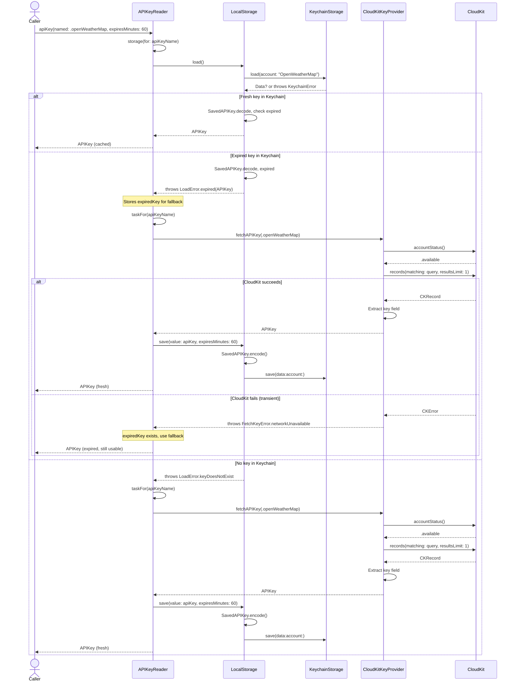

# APIKeyReader Diagrams

## Overview

APIKeyReader is built around an actor coordinator that delegates to protocol-based providers for remote fetching and local caching. The protocol layer enables test injection while keeping CloudKit and Keychain concerns isolated.

## Type Relationships

The diagram shows the core types, their roles (actor, struct, protocol, enum), key members, and how they connect through composition, conformance, and dependency.

```mermaid
classDiagram
    class APIKeyReader {
        <<actor>>
        -keyProvider: any KeyProvider
        -localStorageFactory: (APIKeyName) → any CachedKeyStorage
        -storageCache: [APIKeyName : any CachedKeyStorage]
        -keyFetchTask: [APIKeyName : Task]
        +clearCache(for: APIKeyName) async
        +apiKey(named: APIKeyName, expiresMinutes: Int) async throws APIKey
    }

    class KeyProvider {
        <<protocol>>
        +fetchAPIKey(APIKeyName) async throws APIKey
    }

    class CachedKeyStorage {
        <<protocol>>
        +load() async throws APIKey
        +clear() async
        +save(value: APIKey?, expiresMinutes: Int) async
    }

    class CloudKitKeyProvider {
        <<struct>>
        -recordType: String
        -maxRetryDelaySeconds: TimeInterval
        -accountStatusProvider: () async throws → CKAccountStatus
        -queryProvider: (CKQuery) async throws → Result?
        +fetchAPIKey(APIKeyName) async throws APIKey
    }

    class LocalStorage {
        <<struct>>
        -key: APIKeyName
        +load() async throws APIKey
        +save(value: APIKey?, expiresMinutes: Int) async
        +clear() async
    }

    class KeychainStorage {
        <<enum>>
        +load(account: String) throws Data?$
        +save(data: Data, account: String) Bool$
        +clear(account: String)$
    }

    class APIKey {
        <<struct>>
        +rawValue: String
        +description: String
    }

    class APIKeyName {
        <<struct>>
        +rawValue: String
        +description: String
    }

    class SavedAPIKey {
        <<struct>>
        +key: APIKey
        +updated: Date
        +expiresMinutes: Int
        +expired: Bool
        +encode() throws Data
        +decode(Data) throws SavedAPIKey$
    }

    class FetchKeyError {
        <<enum>>
        missingField(named String)
        cloudKitError(error Error)
        recordNotFound
        cloudKitRestricted
        networkUnavailable
    }

    class LoadError {
        <<enum>>
        expired(APIKey)
        decodeError
        keychainError(any Error)
        keyDoesNotExist
    }

    APIKeyReader --> KeyProvider : uses
    APIKeyReader --> CachedKeyStorage : creates via factory
    APIKeyReader --> APIKeyName : keyed by
    CloudKitKeyProvider ..|> KeyProvider : conforms
    CloudKitKeyProvider ..> FetchKeyError : throws
    LocalStorage ..|> CachedKeyStorage : conforms
    LocalStorage --> KeychainStorage : delegates to
    LocalStorage --> SavedAPIKey : encodes/decodes
    LocalStorage ..> LoadError : throws
    SavedAPIKey --> APIKey : wraps

    style APIKeyReader fill:#1a365d,stroke:#2c5282,stroke-width:2px,color:#ffffff
    style KeyProvider fill:#2d3748,stroke:#4a5568,stroke-width:2px,color:#ffffff
    style CachedKeyStorage fill:#2d3748,stroke:#4a5568,stroke-width:2px,color:#ffffff
    style CloudKitKeyProvider fill:#2b6cb1,stroke:#1a365d,stroke-width:2px,color:#ffffff
    style LocalStorage fill:#2b6cb1,stroke:#1a365d,stroke-width:2px,color:#ffffff
    style KeychainStorage fill:#276749,stroke:#22543d,stroke-width:2px,color:#ffffff
    style APIKey fill:#276749,stroke:#22543d,stroke-width:2px,color:#ffffff
    style APIKeyName fill:#276749,stroke:#22543d,stroke-width:2px,color:#ffffff
    style SavedAPIKey fill:#276749,stroke:#22543d,stroke-width:2px,color:#ffffff
    style FetchKeyError fill:#744210,stroke:#975a16,stroke-width:2px,color:#ffffff
    style LoadError fill:#744210,stroke:#975a16,stroke-width:2px,color:#ffffff
```

## Color Legend

| Color | Role |
|-------|------|
| Dark blue | Coordinator (actor entry point) |
| Gray | Protocols (abstraction boundaries) |
| Blue | Concrete implementations (CloudKit, storage) |
| Green | Value types and utilities |
| Brown | Error types |

## Key Relationships

- **APIKeyReader → KeyProvider / CachedKeyStorage**: The actor depends on protocols, not concrete types. This is the central abstraction enabling testability.
- **CloudKitKeyProvider ..|> KeyProvider**: Conforms via extension. Owns all CloudKit query, retry, and error-mapping logic.
- **LocalStorage ..|> CachedKeyStorage**: Conforms directly. Bridges `SavedAPIKey` encoding to `KeychainStorage` operations.
- **LocalStorage → KeychainStorage**: Delegates low-level `SecItem` calls. `KeychainStorage` is a stateless enum with static methods.
- **SavedAPIKey → APIKey**: Wraps `APIKey` with expiration metadata (`updated`, `expiresMinutes`) for cache invalidation.

## Reading a Key — Sequence Diagram

Shows the runtime flow when a caller requests an API key via `apiKey(named:expiresMinutes:)`. The three branches (cache hit, cache miss, expired fallback) correspond to the `CacheLookupResult` enum returned by `cachedValue(for:apiKeyName:)`.

### Key Observations

- **Actor boundary**: All calls into `APIKeyReader` cross the actor isolation boundary. Internal helper methods (`storage`, `cachedValue`, `taskFor`, `fetchKey`) run within actor isolation.
- **Task deduplication**: `taskFor(apiKeyName)` returns an existing in-flight `Task` if one exists, so concurrent callers await the same CloudKit fetch.
- **Synchronous Keychain**: `KeychainStorage.load` and `.save` are synchronous calls to the Security framework. They complete in <5ms and don't leave the actor's execution context.
- **Fallback decision**: The expired key fallback happens in `fetchKey` — if the fetch throws and `expiredKey` is non-nil, the expired key is returned instead of propagating the error.
