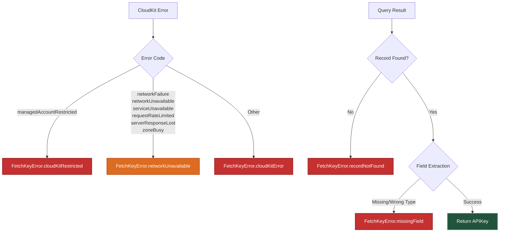

# Error Handling

## Overview

APIKeyReader uses structured error types to distinguish recoverable failures from configuration issues. The error hierarchy provides clear guidance on whether errors are user-facing, developer-facing, or require retry logic.

## Key Design Decisions

### Why Three Error Types

The library defines three error enumerations:

| Error Type | Visibility | Purpose |
|------------|-----------|---------|
| `FetchKeyError` | Public | Thrown to callers, represents fetch failures |
| `LoadError` | Internal | Used by `CachedKeyStorage` to communicate cache state |
| `KeychainStorage.KeychainError` | Internal | Low-level Keychain operation failures |

**Why not a single error type?**

1. **API clarity** — Callers only see `FetchKeyError`, not internal storage states
2. **Error mapping** — Internal errors are mapped to appropriate public errors or handled silently
3. **Separation of concerns** — Cache expiration (`LoadError.expired`) is internal state, not a caller-facing error

### Why LoadError.expired Contains the Key

`LoadError.expired` carries the expired key as an associated value:

```swift
enum LoadError: Error {
    case expired(APIKey)
    // ...
}
```

**Rationale:**

This allows `APIKeyReader` to implement fallback logic:

```swift
catch let loadError as LoadError where loadError == .expired(let key):
    expiredKey = key
```

When CloudKit fetching fails (network error), the reader returns the expired key to maintain availability. Without the associated value, the reader would need to:
- Re-read from keychain (extra I/O)
- Parse the `LoadError` to extract the key (fragile)

Embedding the key makes the fallback path efficient and type-safe.

### Why Localized Strings Are Centralized

All error messages are defined in `Strings.swift` using SwiftUI's localization API:

```swift
enum Strings {
    enum FetchKeyError {
        static let networkUnavailable = String(
            localized: "fetch_key_error_network_unavailable",
            defaultValue: "Unable to fetch API key: Please check your internet connection and try again",
            comment: "User-facing error when a network failure blocks API key fetching."
        )
    }
}
```

**Benefits:**

1. **Single source of truth** — Error messages aren't duplicated across error types
2. **Localization-ready** — String keys can be translated without code changes
3. **Comment-based guidance** — Comments distinguish user-facing vs developer-facing errors

Example comment patterns:
- "User-facing error when..." → Show to users in UI
- "Developer-facing error..." → Log for diagnostics, not user display

### Why Transient Errors Map to networkUnavailable

CloudKit errors classified as transient are mapped to `FetchKeyError.networkUnavailable`:

```swift
if isTransientError(error) {
    throw FetchKeyError.networkUnavailable
}
```

**Why not expose the underlying CloudKit error?**

1. **User expectations** — Users understand "check your internet connection", not "CKError.zoneBusy"
2. **Actionable guidance** — `networkUnavailable` implies "try again later" without CloudKit knowledge
3. **Abstraction** — Callers don't depend on CloudKit error codes, making future backend swaps easier

Permanent errors (invalid credentials, quota exceeded) map to `cloudKitError(error:)` so developers can diagnose them.

### Why cloudKitRestricted Is a Top-Level Case

`FetchKeyError.cloudKitRestricted` is a dedicated case, not bundled with `cloudKitError`:

```swift
case cloudKitRestricted
case cloudKitError(error: Error)
```

**Rationale:**

Restricted iCloud access (MDM policies, parental controls) requires **user action** to resolve:
- Enable iCloud in Settings
- Contact IT admin to lift restrictions

This is different from other CloudKit errors (network failures, quota limits) which may resolve automatically. The dedicated case allows callers to show targeted UI:

```swift
catch FetchKeyError.cloudKitRestricted {
    showAlert("iCloud is disabled. Please enable it in Settings.")
}
```

### Why missingField Is a Developer Error

`FetchKeyError.missingField(named:)` has a "Developer Error" prefix in its message:

```swift
static let missingField = String(
    localized: "fetch_key_error_missing_field",
    defaultValue: "Developer Error: Invalid key configuration - missing %@",
    comment: "Developer-facing error when required CloudKit field is absent or not a string."
)
```

**Why mark it as a developer error?**

Missing fields indicate:
- CloudKit schema drift (field renamed or deleted)
- Wrong record type name
- Field type mismatch (expecting String, got Int)

These are **configuration issues**, not user errors. Marking them "Developer Error" guides support teams to escalate to engineering, not instruct users to fix their network.

### Why Cancellation Errors Are Propagated Untouched

The code checks for `CancellationError` and re-throws it without mapping:

```swift
catch let error as CancellationError {
    throw error
}
```

**Rationale:**

Task cancellation is Swift Concurrency's structured cancellation mechanism. Mapping it to a domain error would:
- Hide the cancellation from upstream callers
- Break cooperative cancellation behavior
- Prevent `Task.isCancelled` checks from working correctly

Propagating `CancellationError` untouched preserves Swift Concurrency semantics.

## Error Classification Decision Tree



## Error Handling Examples

### User-Facing Errors

```swift
do {
    let apiKey = try await apiKeyReader.apiKey(named: .openWeatherMap, expiresMinutes: 60)
} catch FetchKeyError.networkUnavailable {
    showAlert("Unable to fetch API key. Please check your internet connection.")
} catch FetchKeyError.cloudKitRestricted {
    showAlert("iCloud access is restricted. Please enable iCloud in Settings.")
}
```

### Developer-Facing Errors

```swift
do {
    let apiKey = try await apiKeyReader.apiKey(named: .openWeatherMap, expiresMinutes: 60)
} catch FetchKeyError.recordNotFound {
    logger.error("Configuration error: OpenWeatherMap key not found in CloudKit")
    assertionFailure("Missing CloudKit record")
} catch FetchKeyError.missingField(let fieldName) {
    logger.error("Schema error: Missing field \(fieldName) in CloudKit record")
    assertionFailure("CloudKit schema mismatch")
}
```

### Fallback Example

```swift
do {
    let apiKey = try await apiKeyReader.apiKey(named: .openWeatherMap, expiresMinutes: 60)
    // Fresh key — make network request
    makeWeatherRequest(apiKey: apiKey)
} catch FetchKeyError.networkUnavailable {
    // Network down, but library returned expired key (if available)
    // Caller doesn't see the expired key — error is thrown only if no fallback exists
    logger.warning("Using degraded mode (cached data)")
}
```

**Note:** The expired key fallback is **internal** to `APIKeyReader`. If a cached key exists, the reader returns it instead of throwing `networkUnavailable`. The error is only thrown when:
- Network is unavailable AND
- No cached key exists (fresh or expired)

## Error Message Localization

String keys in `Strings.swift` can be localized via `.xcstrings` catalogs:

**Base (English):**
```swift
static let networkUnavailable = String(
    localized: "fetch_key_error_network_unavailable",
    defaultValue: "Unable to fetch API key: Please check your internet connection and try again",
    comment: "User-facing error when a network failure blocks API key fetching."
)
```

**Spanish translation (in `Localizable.xcstrings`):**
```json
{
  "fetch_key_error_network_unavailable": {
    "comment": "User-facing error when a network failure blocks API key fetching.",
    "extractionState": "manual",
    "localizations": {
      "es": {
        "stringUnit": {
          "state": "translated",
          "value": "No se pudo obtener la clave API: Por favor verifica tu conexión a internet e inténtalo de nuevo"
        }
      }
    }
  }
}
```

## See Also

- [Architecture](Architecture.md) — Error type hierarchy rationale
- [CloudKitKeyProvider](CloudKitKeyProvider.md) — Transient error classification
- [Strings](Strings.md) — Centralized error message definitions
