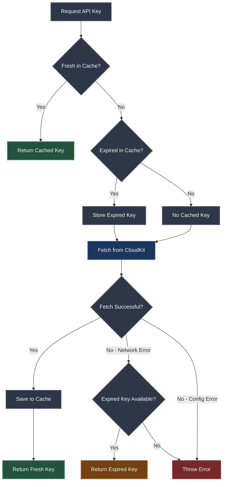

# Error Resilience

## Overview

APIKeyReader implements a multi-layered error handling strategy that prioritizes application availability over strict data freshness. The system gracefully degrades when network conditions are poor or CloudKit is unavailable.

## Key Design Decisions

### Fallback to Expired Keys

When a CloudKit fetch fails, the library returns expired cached keys rather than propagating the error:

```swift
// APIKeyReader.swift, lines 159-174
do {
    return try await task.value
} catch {
    if let expiredKey {
        return expiredKey  // Return stale data instead of failing
    }
    throw error
}
```

This design reflects several real-world considerations:

**API Key Longevity**
- Most third-party API keys remain valid for weeks or months
- An expired cached key from an hour ago is functionally equivalent to a fresh fetch in 99% of cases
- The risk of using a recently expired key is far lower than the cost of a hard failure

**Network Reliability**
- CloudKit can experience regional outages, DNS failures, or rate limiting
- Users frequently encounter no-network scenarios: flights, tunnels, rural areas, international roaming
- Hard failures in these scenarios create poor user experiences and support tickets

**User Experience Priority**
- Apps should degrade gracefully rather than becoming completely non-functional
- Weather apps showing slightly stale data are preferable to error screens
- Background refresh can update keys when connectivity returns

This pattern mirrors HTTP caching strategies like `stale-while-revalidate`, where availability is prioritized over perfect freshness.

### Error Type Differentiation

The library distinguishes between **transient errors** (network failures) and **permanent errors** (misconfiguration):

```swift
// FetchKeyError.swift
enum FetchKeyError: LocalizedError {
    case networkUnavailable       // Transient — fallback to cache
    case recordNotFound           // Permanent — developer error
    case missingField(named: String)  // Permanent — developer error
    case cloudKitError(error: Error)  // May be transient or permanent
}
```

**Transient Errors (trigger fallback)**
- `networkUnavailable` — Airplane mode, poor signal, CloudKit downtime
- Network-related `cloudKitError` cases

**Permanent Errors (propagate to caller)**
- `recordNotFound` — Key doesn't exist in CloudKit (likely a configuration issue)
- `missingField` — CloudKit schema mismatch (developer error)

Transient errors benefit from stale-data fallback, while permanent errors should surface immediately to help developers catch configuration mistakes during development.

### Cache Expiration as a Soft Boundary

Expiration times are treated as **suggestions for refresh**, not hard constraints:

```swift
// LocalStorage.swift, lines 19-24
if let savedAPIKey = try? SavedAPIKey.decode(data) {
    if savedAPIKey.expired {
        throw LoadError.expired(savedAPIKey.key)  // Pass key with error
    }
    return savedAPIKey.key
}
```

The `LoadError.expired` case **includes the expired key** in the error payload. This enables the calling code to decide whether to use it:

```swift
// APIKeyReader.swift, lines 119-121
} catch let LoadError.expired(key) {
    logger.debug("key is expired")
    expiredKey = key  // Store for potential fallback
}
```

This design allows the system to:
1. Attempt a fresh fetch when the cache is stale
2. Fall back to the stale data if the fetch fails
3. Automatically refresh keys during normal operation
4. Never fail completely due to transient network issues

Alternatives considered:
- **Hard expiration** — Would cause failures during network outages
- **No expiration** — Keys would never refresh, potentially using truly obsolete data
- **Separate stale-check method** — Would require an extra Keychain read, doubling overhead

### Task Deduplication

Concurrent requests for the same key share a single CloudKit fetch:

```swift
// APIKeyReader.swift, lines 144-157
func taskFor(_ apiKeyName: APIKeyName) -> FetchKeyTask {
    if let inProgressTask = keyFetchTask[apiKeyName] {
        return inProgressTask  // Reuse existing Task
    }

    let newTask = Task {
        try await apiKeyCloudKit.fetchAPIKey(apiKeyName)
    }
    keyFetchTask[apiKeyName] = newTask
    return newTask
}
```

This prevents duplicate network requests when multiple code paths simultaneously request the same key during app launch or scene restoration.

Without deduplication:
- Multiple views refreshing on launch would trigger redundant CloudKit queries
- SwiftUI view updates could create fetch storms during navigation
- CloudKit rate limits might be hit unnecessarily

The actor isolation ensures thread-safe access to `keyFetchTask` dictionary without manual locking.

## Error Flow Diagram



## Testing Error Scenarios

The resilience strategy is designed to be testable:

```swift
// In production
let apiKey = try await apiKeyReader.apiKey(named: .openWeatherMap, expiresMinutes: 60)

// In tests, simulate network failure
// 1. Prime cache with expired key
localStorage.save(value: mockKey, expiresMinutes: -10)

// 2. Disable network or mock CloudKit error
// 3. Verify expired key is returned rather than throwing
let result = try await apiKeyReader.apiKey(named: .openWeatherMap, expiresMinutes: 60)
XCTAssertEqual(result, mockKey)
```

## See Also

- [LocalStorage](LocalStorage.md) — Keychain-based caching and expiration logic
- [APIKeyReader](APIKeyReader.md) — Actor-based coordination and task deduplication
