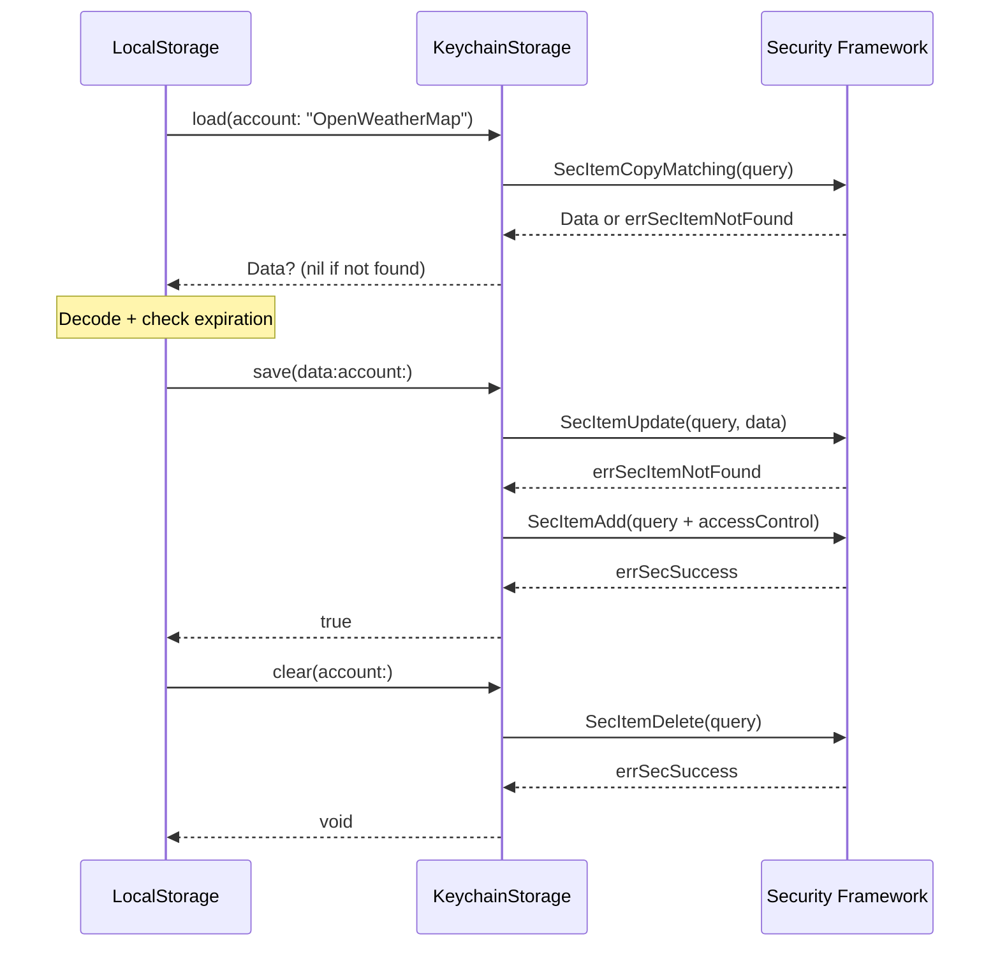

# KeychainStorage

## Overview

`KeychainStorage` provides low-level Keychain operations for storing API keys. It wraps the Security framework's `SecItem` APIs with type-safe Swift interfaces and enforces device-local, encrypted storage.

## Key Design Decisions

### Why Synchronous Operations

Keychain operations are intentionally synchronous:

```swift
static func load(account: String) throws -> Data? {
    // Synchronous Security framework call
    let status = SecItemCopyMatching(query as CFDictionary, &result)
    // ...
}
```

**Rationale:**

1. **Actor isolation guarantees** — `APIKeyReader` (an actor) calls these methods. Wrapping keychain calls in `Task.detached` would break actor isolation and introduce race conditions.

2. **Performance characteristics** — Keychain reads/writes complete in **<5ms** on modern devices. The overhead of async overhead exceeds the operation time.

3. **Low cardinality** — This library serves key lookups (typically <10 unique keys), not high-throughput scenarios where async would matter.

If keychain operations were async, they would need to be `nonisolated` or wrapped in unstructured tasks, both of which compromise the actor's concurrency safety.

### Why SecAccessControl with Device-Only Storage

Keys are stored with explicit access control:

```swift
let accessControl = SecAccessControlCreateWithFlags(
    nil,
    kSecAttrAccessibleWhenUnlockedThisDeviceOnly,
    [],  // No biometric requirements
    &accessControlError
)
addQuery[kSecAttrAccessControl as String] = accessControl
```

**Access policy breakdown:**

| Flag | Effect | Why This Choice |
|------|--------|-----------------|
| `kSecAttrAccessibleWhenUnlockedThisDeviceOnly` | Readable only when device is unlocked, never syncs | Prevents keys from appearing in iCloud Keychain or device backups |
| Empty flags `[]` | No biometric/passcode requirement | Keys originate from public CloudKit database, not user secrets |

**Why no biometric requirement?**

These keys are fetched from a **public CloudKit database**. Requiring Face ID/Touch ID would be security theater — anyone with the app can fetch the same key from CloudKit. The Keychain protects the cache from backup extraction, not from authorized app access.

### Why Update-Then-Add Pattern

The save operation tries to update first, then adds if not found:

```swift
let updateStatus = SecItemUpdate(query as CFDictionary, attributesToUpdate as CFDictionary)
switch updateStatus {
case errSecSuccess:
    return true
case errSecItemNotFound:
    var addQuery = query
    addQuery[kSecValueData as String] = data
    let addStatus = SecItemAdd(addQuery as CFDictionary, nil)
    // ...
}
```

**Why not check if item exists first?**

This pattern uses fewer Keychain operations:
- **Common case** (key already exists): 1 operation (update succeeds)
- **First save**: 2 operations (update fails, add succeeds)

Checking existence first would require:
- **Common case**: 2 operations (check + update)
- **First save**: 2 operations (check + add)

The update-then-add pattern optimizes for the common case (cached key being refreshed).

### Why Access Attribute Selection Logic

`preservedAccessAttributes` selects the correct access attribute when working with existing keychain entries:

```swift
static func preservedAccessAttributes(from attributes: [String: Any]) -> [String: Any] {
    if let accessControl = attributes[kSecAttrAccessControl as String] {
        return [kSecAttrAccessControl as String: accessControl]
    }
    if let accessible = attributes[kSecAttrAccessible as String] {
        return [kSecAttrAccessible as String: accessible]
    }
    return [:]
}
```

**Rationale:**

1. **Mutual exclusivity** — `kSecAttrAccessControl` and `kSecAttrAccessible` cannot coexist in the same keychain item; the code prefers `kSecAttrAccessControl` when both are present
2. **Correctness** — Callers needing to preserve access semantics during updates can use this to extract the right attribute

### Why Service-Based Scoping

All keychain entries use a fixed service identifier:

```swift
private static let service = "com.spearware.APIKeyReader"
```

**Benefits:**
- Scopes all APIKeyReader keys together (easy cleanup)
- Prevents collisions with other apps using the same account names
- Simplifies queries (single service value)

The `account` parameter (set to `APIKeyName.rawValue`) distinguishes different keys within the service.

### Why Clear Ignores Errors Except Logging

The `clear` method treats "not found" as success:

```swift
let deleteStatus = SecItemDelete(baseQuery(account: account) as CFDictionary)
guard deleteStatus == errSecSuccess || deleteStatus == errSecItemNotFound else {
    logger.error("Keychain delete failed with OSStatus: \(deleteStatus)")
    return
}
```

**Rationale:**

Clearing a non-existent key is a no-op (idempotent). The caller doesn't care whether the key was absent or successfully deleted — only that it's gone afterward.

Other errors (e.g., `-34018` Keychain access denied) are logged but don't throw because:
- The caller (`LocalStorage.clear`) is `async` but doesn't propagate errors
- Clearing during logout or cache invalidation should be best-effort

### Why TaskLocal for Test Backend Injection

`KeychainStorage` uses `@TaskLocal` to inject test backends:

```swift
@TaskLocal
private static var testBackend: TestBackend?

#if DEBUG
static func withTestBackend<R>(
    load: @escaping KeychainLoad,
    save: @escaping KeychainSave,
    clear: @escaping KeychainClear,
    _ operation: () async throws -> R
) async rethrows -> R {
    try await $testBackend.withValue(
        TestBackend(load: load, save: save, clear: clear),
        operation: operation
    )
}
#endif
```

**Why task-local storage instead of dependency injection?**

1. **Enum type constraint** — `KeychainStorage` is an enum (stateless utility), not a struct or class that can hold injected dependencies
2. **Actor-safe** — Task-local values are propagated through async call chains without breaking actor isolation
3. **Test isolation** — Each test gets its own backend without global state pollution
4. **Zero production overhead** — The `#if DEBUG` guard ensures this code is stripped from release builds

Without task-local storage, tests would need to:
- Make `KeychainStorage` a protocol (adds complexity)
- Use global mutable state (not thread-safe)
- Directly mock Security framework calls (requires swizzling or code injection)

## Error Handling Strategy

| Error | Meaning | Handling |
|-------|---------|----------|
| `errSecSuccess` | Operation succeeded | Return success |
| `errSecItemNotFound` | Key doesn't exist | Return `nil` (load) or success (clear) |
| Other `OSStatus` | Keychain access denied, corrupted, etc. | Throw `KeychainError.unexpectedStatus` (load) or log error (save/clear) |

The enumeration of `OSStatus` codes is intentionally limited. Most errors indicate:
- Keychain corruption (rare, requires device restore)
- Sandboxing issues (developer configuration error)
- Disk full (user must free space)

These are not recoverable by the library, so they're logged for diagnostics.

## Keychain Query Structure

Base query for all operations:

```swift
[
    kSecClass: kSecClassGenericPassword,
    kSecAttrService: "com.spearware.APIKeyReader",
    kSecAttrAccount: apiKeyName.rawValue
]
```

**Load query additions:**
```swift
kSecMatchLimit: kSecMatchLimitOne
kSecReturnData: true
```

**Save query additions (add only):**
```swift
kSecValueData: encodedData
kSecAttrAccessControl: accessControl
```

## Usage Flow



## See Also

- [Architecture](Architecture.md) — Why keychain over UserDefaults
- [LocalStorage](LocalStorage.md) — Higher-level cache operations using KeychainStorage
