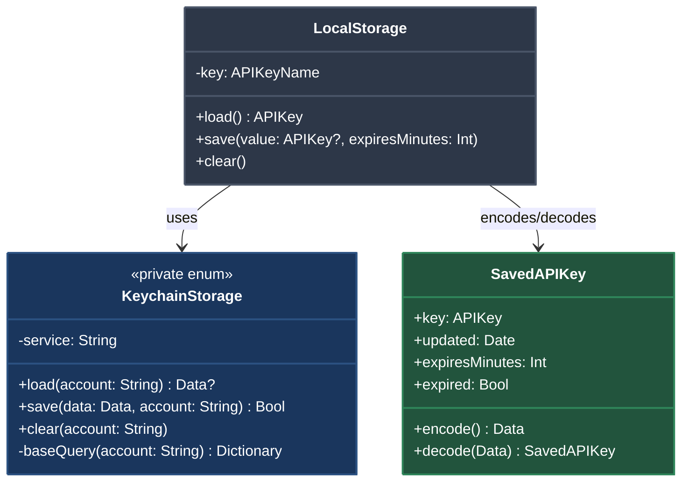

# LocalStorage

## Overview

LocalStorage provides secure persistent caching for API keys using Apple's Keychain Services. Keys are stored with expiration metadata, enabling the library to serve fresh data while maintaining an expired fallback during network outages.

## Key Design Decisions

### Why Keychain Instead of UserDefaults

API keys are credentials that grant access to third-party services. Storing them in UserDefaults presents several security risks:

1. **No encryption at rest** — UserDefaults stores data as plain-text plists in the app's sandbox
2. **Accessible in backups** — iCloud and iTunes backups include UserDefaults, potentially exposing keys to backup extraction tools
3. **Accessible in device snapshots** — Keys persist in filesystem dumps and forensic imaging
4. **No access control** — Any code within the app process can read UserDefaults

Keychain addresses these concerns:

- **Hardware encryption** — Data is encrypted using device-specific keys, often backed by the Secure Enclave
- **Access control policies** — `kSecAttrAccessibleAfterFirstUnlockThisDeviceOnly` ensures keys are only accessible after the device is unlocked and are excluded from iCloud/iTunes backups
- **Protected from backups** — Keys marked with `ThisDeviceOnly` do not sync to iCloud or appear in unencrypted backups
- **OS-enforced security** — The Security framework provides defense against unauthorized access

This choice aligns with Apple's security guidelines and App Store review requirements for credential storage.

### Update-or-Add Pattern in KeychainStorage.save()

The Keychain API requires different operations for updating existing items versus adding new ones:

```swift
let updateStatus = SecItemUpdate(query, attributes)
switch updateStatus {
case errSecSuccess:
    return true
case errSecItemNotFound:
    // Item doesn't exist — add it instead
    let addStatus = SecItemAdd(addQuery, nil)
    return addStatus == errSecSuccess
}
```

This two-step pattern exists because:

1. **Keychain doesn't support upsert** — Unlike databases with `INSERT OR REPLACE`, the Keychain has separate APIs for update and add operations
2. **Performance optimization** — Attempting update first is faster for the common case (refreshing existing keys) than querying existence before deciding
3. **Atomic fallback** — If the key was deleted between our last read and this write, the `errSecItemNotFound` code path handles it gracefully

The alternative (query first, then add or update) requires two Keychain operations for every save, doubling the overhead.

### Error Resilience Strategy: Returning Expired Keys as Fallback

When a CloudKit fetch fails but an expired cached key exists, the library returns the stale key rather than throwing an error:

```swift
// APIKeyReader.swift
if let expiredKey {
    return expiredKey
}
throw error
```

This decision reflects real-world network conditions where:

1. **Availability trumps freshness** — Most API keys remain valid for weeks or months; an hour-old expired key is almost always still functional
2. **Graceful degradation** — Users on flights, in tunnels, or experiencing CloudKit outages can continue using the app instead of encountering hard failures
3. **Reduced support burden** — Apps don't crash or show error screens due to transient network issues
4. **CloudKit reliability** — Apple's services occasionally experience regional outages; apps shouldn't become unusable

The expiration mechanism remains important because it ensures fresh keys are fetched regularly during normal operation, while the fallback prevents catastrophic failures during network unavailability.

This pattern is similar to HTTP's `Cache-Control: stale-while-revalidate`, prioritizing user experience over perfect cache hygiene.

## Storage Implementation

### Keychain Query Structure

The library uses a service-scoped generic password storage model:

```swift
kSecClass: kSecClassGenericPassword
kSecAttrService: "com.spearware.APIKeyReader"
kSecAttrAccount: apiKeyName.rawValue
```

Each API key is stored as a separate Keychain item, identified by the combination of service and account. This approach allows:

- Independent expiration tracking per key
- Selective clearing without affecting other keys
- Future extensibility for per-key access control policies

### Access Control Policy

Keys use `kSecAttrAccessibleAfterFirstUnlockThisDeviceOnly`:

- **AfterFirstUnlock** — Accessible after the user unlocks the device once after boot, balancing security with availability for background tasks
- **ThisDeviceOnly** — Excluded from backups and iCloud Keychain sync, preventing key leakage through backup restoration or device-to-device sync

This policy ensures keys survive app reinstalls on the same device but require re-fetch on new devices, which is appropriate for device-specific security contexts.

## Usage

```swift
let localStorage = LocalStorage(key: .openWeatherMap)

// Attempt to load cached key
do {
    let freshKey = try localStorage.load()
    // Use fresh key
} catch LoadError.expired(let expiredKey) {
    // Key exists but is expired — attempt refresh from CloudKit
    // Fall back to expiredKey if network fails
} catch LoadError.keyDoesNotExist {
    // Fetch from CloudKit for first-time use
}

// Save with 60-minute expiration
localStorage.save(value: apiKey, expiresMinutes: 60)
```

## Architecture



## See Also

- [Error Resilience](ErrorResilience.md) — Comprehensive fallback and recovery strategy
- [APIKeyReader](APIKeyReader.md) — Main actor coordinating fetch and cache operations
