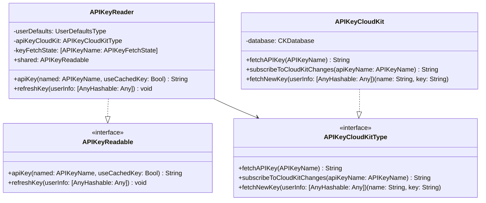
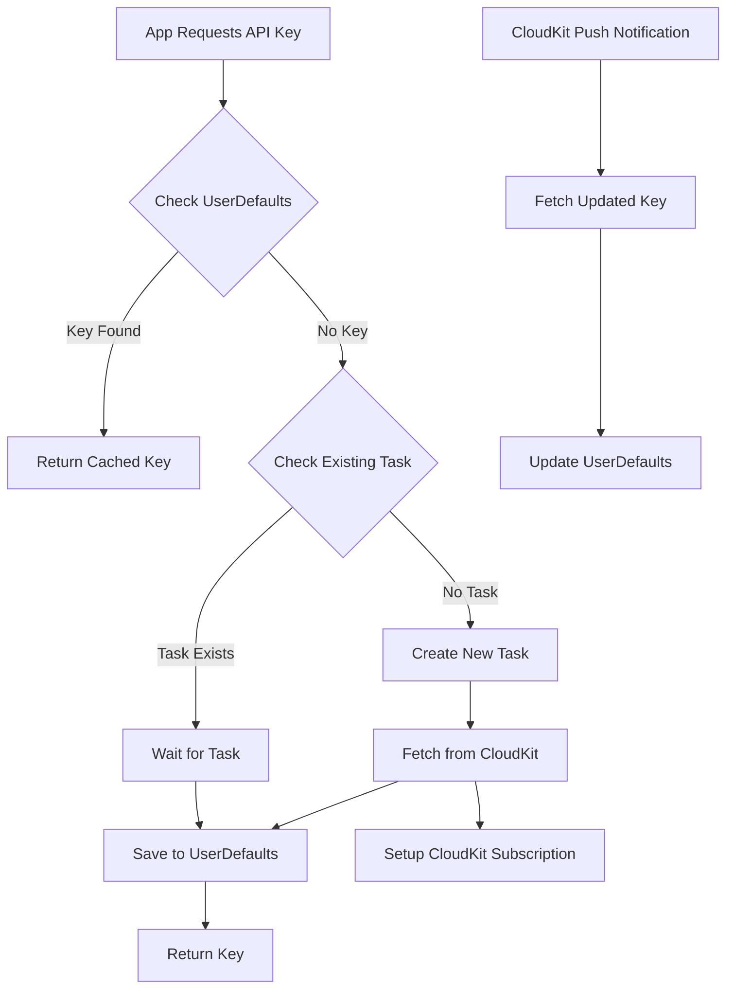
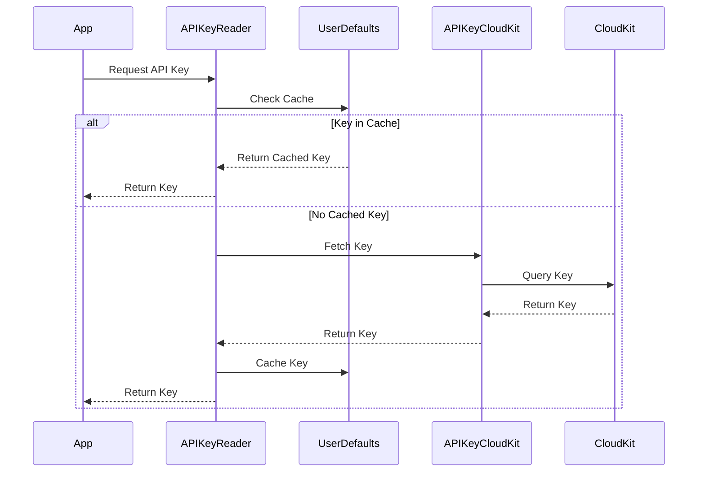

# API Key Management System Documentation

## Overview

The API Key Management System is a robust solution for handling API keys in iOS applications using CloudKit as a backend. It provides secure key storage, efficient caching, and real-time updates through CloudKit subscriptions.

### Key Features

- Secure API key storage in CloudKit
- Local caching with UserDefaults
- Thread-safe operations using Swift actors
- Real-time key updates via CloudKit subscriptions
- Efficient handling of concurrent requests
- Comprehensive error handling

## System Architecture

### Class Diagram



### Flow Diagram



### Sequence Diagram (Key Fetch)



## Usage Examples

### Basic Key Retrieval

```swift
// Using shared instance
let apiKey = try await APIKeyReader.shared.apiKey(named: .openWeatherMap)

// Custom instance
let reader = APIKeyReader(userDefaults: UserDefaults.standard,
                         apiKeyCloudKit: APIKeyCloudKit())
let apiKey = try await reader.apiKey(named: .openWeatherMap)
```

### Handling CloudKit Updates

```swift
// In AppDelegate
func application(_ application: UIApplication,
                didReceiveRemoteNotification userInfo: [AnyHashable : Any],
                fetchCompletionHandler completionHandler: @escaping (UIBackgroundFetchResult) -> Void) {
    Task {
        do {
            try await APIKeyReader.shared.refreshKey(userInfo: userInfo)
            completionHandler(.newData)
        } catch {
            completionHandler(.failed)
        }
    }
}
```

### Error Handling

```swift
do {
    let apiKey = try await apiKeyReader.apiKey(named: .openWeatherMap)
    // Use apiKey
} catch FetchKeyError.cloudKitError(let error) {
    // Handle CloudKit error
} catch FetchKeyError.recordNotFound {
    // Handle missing key
} catch FetchKeyError.missingField(let fieldName) {
    // Handle missing field
} catch {
    // Handle other errors
}
```

## Implementation Details

### Key States
The system manages API key fetching states using an enum:

```swift
private enum APIKeyFetchState {
    case inProgress(Task<APIKey, Error>)
    case finished(APIKey)
}
```

This enables efficient handling of concurrent requests by:
1. Preventing duplicate CloudKit queries
2. Ensuring all concurrent requests receive the same result
3. Maintaining thread safety through the actor system

### CloudKit Integration
The system uses CloudKit's public database for key storage:

1. Keys are stored in a "Keys" record type
2. Each record contains:
   - name: The API key identifier
   - key: The actual API key value
3. CloudKit subscriptions enable push notifications when keys are updated

### Caching Strategy
The system implements a two-level caching strategy:

1. In-memory cache for active fetching tasks
2. UserDefaults persistence for retrieved keys

This approach provides:
- Minimal CloudKit queries
- Fast key retrieval
- Automatic key updates through CloudKit subscriptions

## Error Handling

The system defines several error types through `FetchKeyError`:

```swift
public enum FetchKeyError: Error {
    case missingField(named: String)
    case userInfoNotCKNotification
    case cloudKitError(error: Error)
    case recordNotFound
}
```

Each error type corresponds to a specific failure scenario:
- `missingField`: Required field not found in CloudKit record
- `userInfoNotCKNotification`: Invalid push notification format
- `cloudKitError`: CloudKit operation failure
- `recordNotFound`: No matching key found in CloudKit
