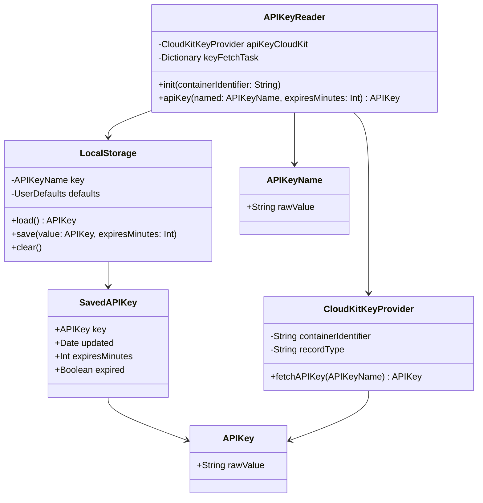
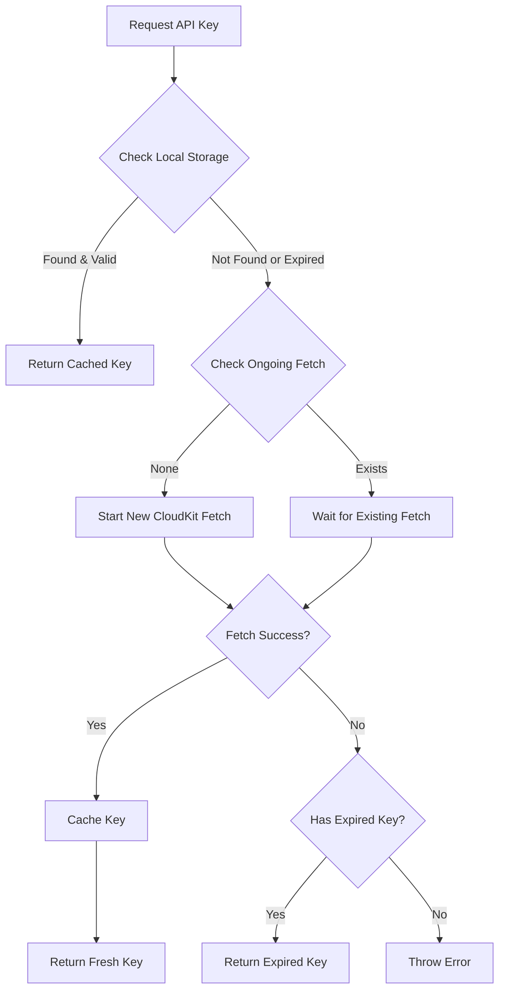
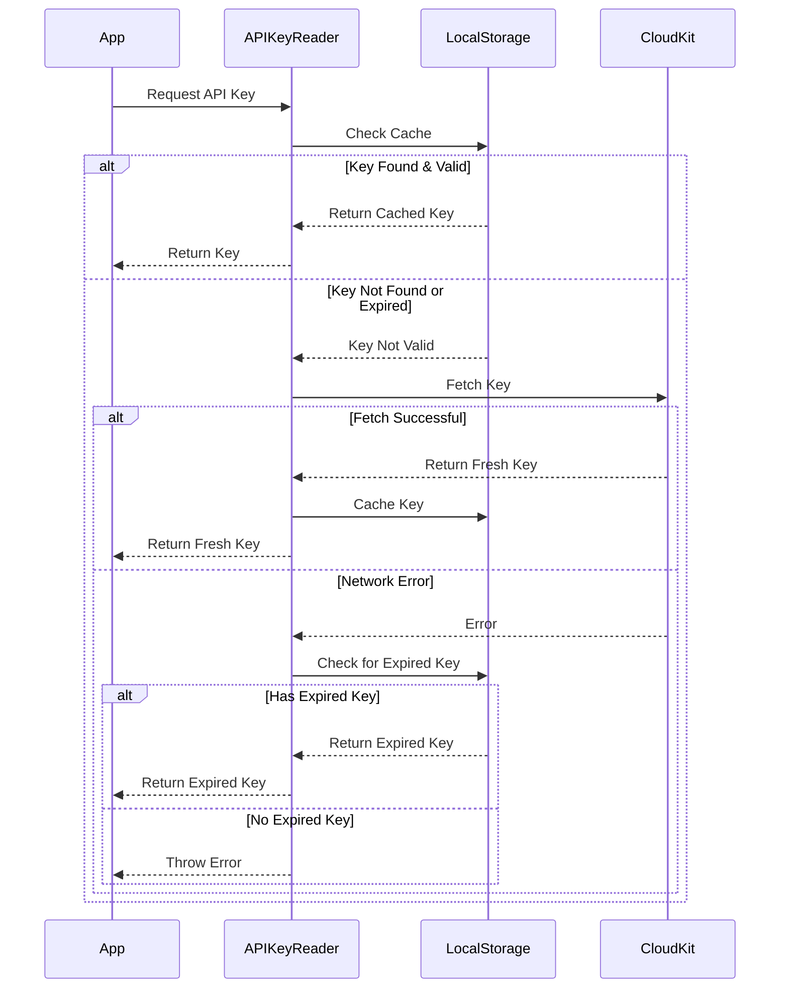

# API Key Management System Documentation

This documentation covers a Swift-based API key management system that securely handles API keys using CloudKit for storage and local caching. The system provides a robust way to manage API keys with features like expiration, caching, and error handling.

## System Overview

The system is designed to:
1. Securely store API keys in CloudKit
2. Cache keys locally with expiration
3. Handle network failures gracefully
4. Provide type-safe API key access

### Class Diagram



### Flow Diagram



### Sequence Diagram



## Key Components

### APIKeyReader

The main entry point for the API key management system. It's implemented as an actor to ensure thread-safe access to shared resources.

```swift
// Usage example
let apiKeyReader = APIKeyReader(containerIdentifier: "iCloud.com.your.container")
let apiKey = try await apiKeyReader.apiKey(
    named: .openWeatherMap,
    expiresMinutes: 60
)
```

### CloudKitKeyProvider

Handles the interaction with CloudKit for retrieving API keys. It expects a specific schema in CloudKit:

```swift
// CloudKit Schema
// Table: "Keys"
// Fields:
//   - name: String (key identifier)
//   - key: String (actual API key value)
```

### LocalStorage

Manages the local caching of API keys using UserDefaults with expiration tracking.

### Error Handling

The system defines several error types:

```swift
enum FetchKeyError: LocalizedError {
    case missingField(named: String)
    case cloudKitError(error: Error)
    case recordNotFound
    case networkUnavailable
}

enum LoadError: Error {
    case expired(APIKey)
    case decodeError
    case keyDoesNotExist
}
```

## Key Features

1. **Concurrent Request Handling**: Multiple requests for the same key are coalesced into a single CloudKit fetch operation.

2. **Graceful Degradation**: If network connectivity is lost, the system can fall back to expired keys rather than failing completely.

3. **Type Safety**: Uses strongly-typed `APIKey` and `APIKeyName` types to prevent errors.

4. **Automatic Expiration**: Cached keys automatically expire after a configurable duration.

## Best Practices

1. **Initialization**:
   ```swift
   // Create an instance with your container identifier
   let apiKeyReader = APIKeyReader(containerIdentifier: "iCloud.com.your.container")
   ```

2. **Error Handling**:
   ```swift
   do {
       let key = try await apiKeyReader.apiKey(
           named: .myAPIKey,
           expiresMinutes: 60
       )
   } catch FetchKeyError.networkUnavailable {
       // Handle offline scenario
   } catch {
       // Handle other errors
   }
   ```

3. **Key Names**:
   ```swift
   extension APIKeyName {
       static let openWeatherMap = Self(rawValue: "openWeatherMap")
       static let googleMaps = Self(rawValue: "googleMaps")
   }
   ```

## Security Considerations

1. Keys are stored in CloudKit's public database but should be protected by app-level authentication
2. Local cache uses UserDefaults - consider using Keychain for higher security
3. Expired keys are used as fallback - implement server-side validation for critical operations
